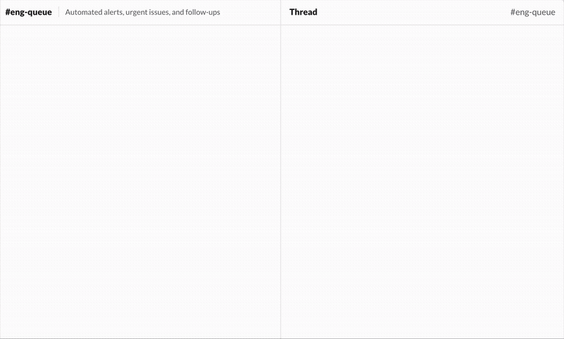

# Roomote

Roomote is the flexible, self-hostable cloud coding agent that works alongside
your team. It's not an IDE or a local copilot: it's a full stack application,
exposed as a shared, always-on agent to which your team can assign work and get
back pre-reviewed, verified pull requests.



It's an open, self-hostable platform that helps teams move agentic coding work:

- From single-player to multiplayer
- From synchronous to asynchronous
- From reactive to proactive
- From closed to open

It does it by running agents in ephemeral, isolated sandboxes, where they make
changes, verify their work, and create PRs. Roomote can answer questions, take
screenshots of its changes, and read/write to your services (logs, monitoring,
databases, etc).

Roomote prizes flexibility while optimizing for user experience:

- Quick setup and a consumer-grade web UI
- Model-agnostic inference provider setup with bring-your-own-key support
- Source control via GitHub, GitLab, Gitea, and Azure DevOps
- Agent interactions via Slack, Microsoft Teams, Telegram, and the web
- Sandbox compute via Modal, E2B, Daytona, and Docker
- Self-configuring agent development environments
- Live web previews of agent changes from sandboxes
- Dozens of tool integrations (task management, logs, monitoring, documents, etc)

## Requirements

- A model provider API key, such as OpenRouter, Anthropic, OpenAI, etc
- A source-control service, such as GitHub, GitLab, Gitea, or Azure DevOps
- A communications provider, such as Slack, Microsoft Teams, or Telegram
  (optional but strongly recommended)
- Somewhere to run it: a single Ubuntu/Debian host, Railway, Coolify, Fly.io,
  etc

For live sandbox previews and production deployments, you'll need DNS
configuration access.

## Quick Start

_We're interested in PRs for tested support for other PaaS providers._

### Railway

Railway uses managed Postgres/Redis and hosted compute such as Modal, E2B, or
Daytona. Docker compute is not available there. The template below tracks the
stable `main` channel; a develop-channel template also exists — see
[deploy/railway/README.md](deploy/railway/README.md).

[](https://railway.com/deploy/Rj2cFo)

### Coolify

Deploy the stack as a Docker Compose resource from the maintained
template. Coolify runs on your own server and defaults to Docker compute on
that host; see [deploy/coolify/README.md](deploy/coolify/README.md).

### Render

Render deploys the maintained Blueprint ([render.yaml](render.yaml)) with
managed Postgres and Key Value (Redis) plus hosted compute such as Modal,
E2B, or Daytona. Docker compute is not available there; see
[deploy/render/README.md](deploy/render/README.md).

[](https://render.com/deploy?repo=https://github.com/RooCodeInc/Roomote)

### Fly.io

Run the stack as a single Fly app (one Machine per service) with Fly Managed
Postgres, Upstash Redis, and Tigris object storage from the maintained
`fly.toml`. Docker compute is not available there, so task execution uses
hosted compute such as Modal, E2B, or Daytona. Fly has no one-click template
marketplace, so deploys are a short copy-paste `flyctl` sequence; see
[deploy/fly/README.md](deploy/fly/README.md).

### Bare machine

SSH into a fresh Ubuntu or Debian server (x86_64 or arm64) with at least 4 GB RAM
recommended and run the installer as root:

```sh
curl -fsSL https://get.roomote.dev | bash
```

If your SSH user is not root, run it through `sudo bash`:

```sh
curl -fsSL https://get.roomote.dev | sudo bash
```

The installer installs Docker when needed, generates deployment secrets, starts
the production Compose stack from GHCR images, and prints a setup link. By
default it uses an `sslip.io` hostname derived from the server IP, so no DNS is
needed for a trial. For production, pass `--domain roomote.example.com` after
pointing the app, preview, and wildcard preview DNS records at the host.

Interested in a Roomote-managed deployment? [Ping us](mailto:help@roomote.dev).

Read more on [Self-hosting](https://docs.roomote.dev/self-hosting) in the docs.

## Documentation

- [Public docs](https://docs.roomote.dev) for admins and users
- [Local development](LOCAL_DEVELOPMENT.md) for contributors

## License, Security, And Contributions

Roomote is licensed under the Fair Core License 1.0 with an Apache-2.0
future grant (FCL-1.0-ALv2). See [LICENSE](LICENSE). A deployment is free
for up to 10 registered users — every user account counts toward the
limit; larger deployments require a paid license key entered in
Settings → Users. Per the license terms, the license key functionality may
not be disabled or circumvented. Need a license? Email [help@roomote.dev](mailto:help@roomote.dev)

Security reports should be sent privately. See [SECURITY.md](SECURITY.md).
Contribution expectations and the Contributor License Agreement requirement are
in [CONTRIBUTING.md](CONTRIBUTING.md); the agreement itself is in [CLA.md](CLA.md).
Trademark guidance is in [TRADEMARKS.md](TRADEMARKS.md).
